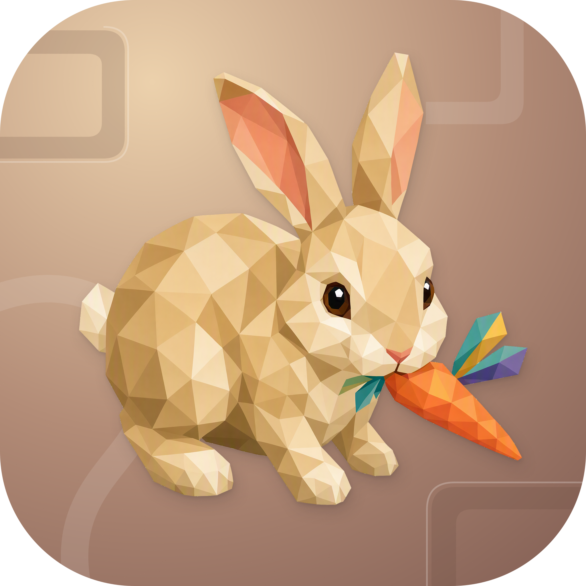
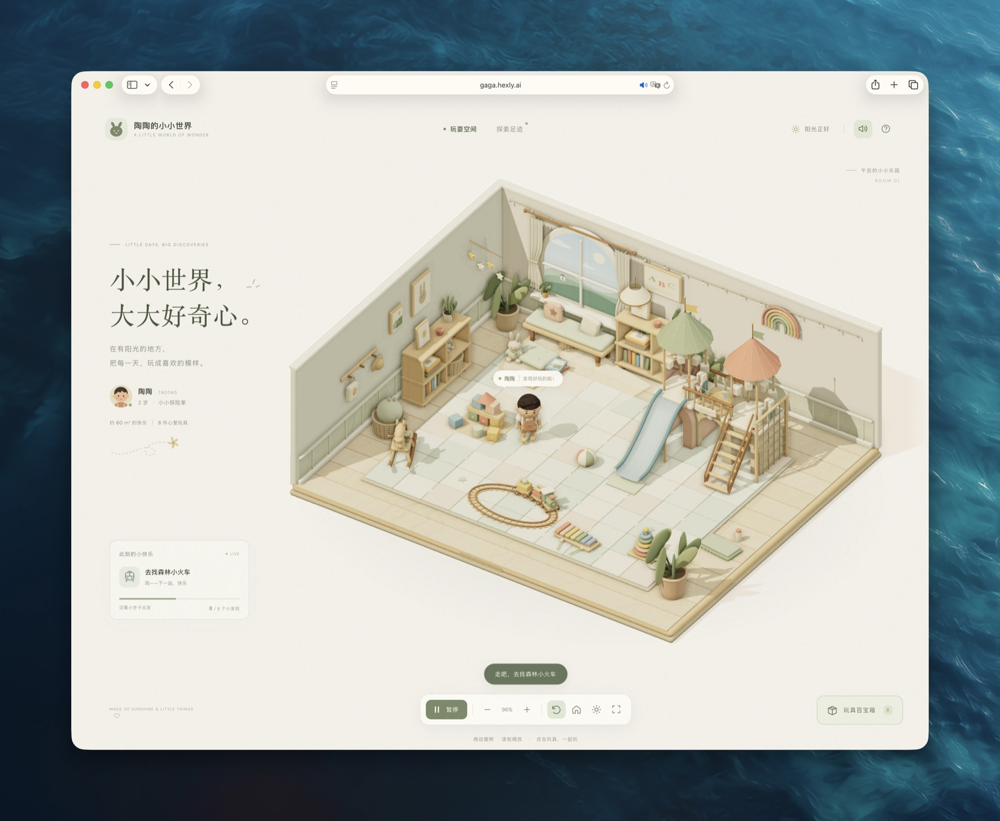

<p align="center">
  
</p>

<h1 align="center">Gaga</h1>

<p align="center">观察陶陶自由探索，或选一件玩具，陪他在三维小屋里玩耍。</p>

<p align="center">
  <a href="https://gaga.hexly.ai">站点</a> ·
  <a href="docs/README.en.md">English</a>
</p>

<p align="center">
  
</p>

## 这是什么

Gaga（陶陶的小小世界）是一个网页 3D 玩耍空间。虚拟角色陶陶会自己选择玩具、绕开障碍、走到互动位置，再做对应动作；你也可以点击玩具引导他。这里没有分数或通关任务。

房间、角色、玩具和绘本插画由代码生成，行为使用本地规则、动作片段与 A* 寻路。Three.js 负责场景，普通 DOM 与 CSS 提供界面，不依赖远程模型服务或服务端计算。

## 功能

- 在积木、绘本、轨道火车、布球、城堡爬架、木马、木琴与套圈之间自主探索或指定下一站。
- 玩具与角色动作同步：翻书、堆积木、敲木琴、骑木马，以及爬城堡、过绳网和滑滑梯。
- 拖动或自动旋转视角，缩放场景、近距离跟随角色，背面的墙会随视角隐藏。
- 切换昼夜灯光，手动开启默认静音的环境音乐与玩具音效。
- 在「探索足迹」查看当天的虚拟玩具访问记录，在玩具百宝箱按活动类型筛选。
- 支持触屏旋转与捏合缩放；系统启用「减少动态效果」时，首次进入保持暂停。

当天足迹存于当前浏览器的 localStorage，重新加载可保留当天发现。它不保存角色当前位置或进行中的动作，也没有账号或云端同步；旧日期记录会在载入与继续玩耍时过滤。

## 使用

在支持 WebGL 2、已开启硬件加速的现代浏览器中打开[站点](https://gaga.hexly.ai)。陶陶会自行探索，也可点击场景中的玩具或打开「玩具百宝箱」。

| 操作 | 效果 |
| --- | --- |
| 拖动画面 / 单指拖动 | 旋转视角 |
| 滚轮 / 双指捏合 / 缩放按钮 | 放大、缩小 |
| 点击玩具 / 玩具百宝箱 | 引导陶陶去玩 |
| 点击陶陶头像 | 切换近距离跟随与全景 |
| Space | 暂停或继续 |
| R | 恢复初始视角 |
| T | 打开玩具百宝箱 |
| M | 开关环境音乐 |
| N | 切换昼夜 |

城堡和木马互动中选择其他玩具时，会先把下一站排队，完成当前动作并回到地面后再出发。选择玩具也会让暂停中的陶陶继续活动。

## 开发

需要 Node.js 20.19+ 或 22.12+ 与 npm；浏览器需支持 WebGL 2。

```bash
git clone https://github.com/nocoo/gaga.git
cd gaga
npm ci
npm run dev
```

开发默认地址为 `http://localhost:5177`，预览默认使用 4177；端口占用时以终端输出为准。应用不需要环境变量或数据库，字体与站点图像随静态资源提供。

```bash
npm run typecheck
npm run build
npm run preview
```

构建输出在 `dist/`，当前通过 Cloudflare Workers Static Assets 托管。Worker 名称为 `gagaya`，域名与资源配置见 [wrangler.jsonc](wrangler.jsonc)。仓库的 `npm run deploy` 需要单独准备 Wrangler CLI 与 Cloudflare 访问权限，Wrangler 当前未列入项目依赖。

开发模式提供 `window.__TAOTAO__` 诊断接口，生产构建不会导出它。

| 路径 | 内容 |
| --- | --- |
| `src/main.ts`、`src/ui`、`src/style.css` | 启动、错误提示、界面与足迹 |
| `src/world` | 渲染、相机、房间、拾取与寻路 |
| `src/world/toys` | 玩具模型、互动路径与注册表 |
| `src/character` | 角色、探索逻辑与动作片段 |
| `src/audio/Soundscape.ts` | 合成音乐与玩具音效 |
| `scripts/smoke.mjs` | 浏览器流程检查 |

## 测试

```bash
npx playwright install chromium
npm run test:e2e
```

脚本默认自动启动仅监听 `127.0.0.1` 的临时 Vite 服务，使用系统分配的端口。优先使用本机 Chrome / Chromium，找不到时使用 Playwright Chromium；可通过 `PLAYWRIGHT_CHROMIUM_EXECUTABLE` 指定浏览器路径。

截图写入 `artifacts/`。`PLAYWRIGHT_BASE_URL` 只应用于已有的开发服务器；此测试依赖开发诊断接口，不能指向生产预览，使用外部服务时也不会检查热更新。

仓库没有独立单元或 API 测试命令；当前 CI 执行类型检查与构建，浏览器流程需单独运行。

## 技术栈


| 部分 | 实现 |
| --- | --- |
| 场景与角色 | TypeScript、Three.js、WebGL 2、Canvas 纹理 |
| 界面 | DOM、CSS、SVG |
| 音频与足迹 | Web Audio、localStorage |
| 构建与托管 | Vite、Cloudflare Workers Static Assets |
| 浏览器测试 | Playwright |

## 文档

- [品牌素材说明](assets/brand/README.md)
- [标识设计](https://hexly.ai/logos/gaga)
- [玩具注册表](src/world/toys/index.ts)与[动作定义](src/character/actions.ts)

## 许可证

[MIT](LICENSE) © 2026 Zheng Li。DM Sans 字体使用 [SIL Open Font License](public/fonts/OFL.txt)。
